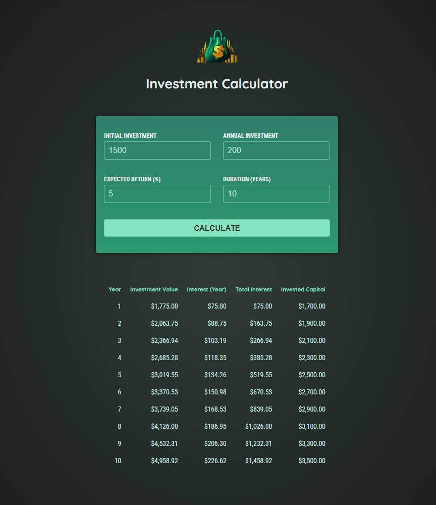

# Investment Calculator

The ever-so-aptly named *Investment Calculator* is a web application, written in Angular v18, which calculates a total investment value, the amount of interest accrued that year and in total, and the total amount of capital invested. This data is based on initial values provided by the user, namely: the intial investment, the amount invested annually, the expected return percentage, and the total number of years to invest.

> This project was created to follow along with the Udemy course [*Angular - The Complete Guide (2024 Edition)*](https://www.udemy.com/course/the-complete-guide-to-angular-2/) by Maximilian Schwarzmüller. All CSS styling and calculation function logic was provided as part of the course, as the focus was on learning and implementing Angular.

&nbsp;

# Angular Information & Setup

*This project was generated with [Angular CLI](https://github.com/angular/angular-cli) version 18.1.0.*

## Development server

Run `ng serve` for a dev server. Navigate to `http://localhost:4200/`. The application will automatically reload if you change any of the source files.

## Code scaffolding

Run `ng generate component component-name` to generate a new component. You can also use `ng generate directive|pipe|service|class|guard|interface|enum|module`.

## Build

Run `ng build` to build the project. The build artifacts will be stored in the `dist/` directory.

## Running unit tests

Run `ng test` to execute the unit tests via [Karma](https://karma-runner.github.io).

## Running end-to-end tests

Run `ng e2e` to execute the end-to-end tests via a platform of your choice. To use this command, you need to first add a package that implements end-to-end testing capabilities.

## Further help

To get more help on the Angular CLI use `ng help` or go check out the [Angular CLI Overview and Command Reference](https://angular.dev/tools/cli) page.
